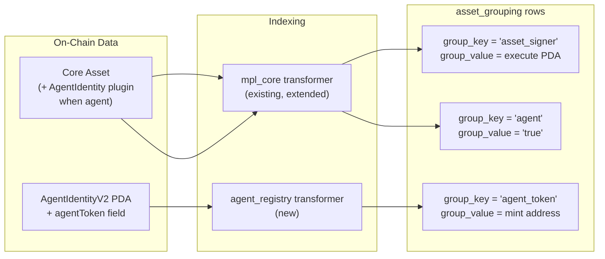

# Index Agent Tokens in DAS

## Problem

There is no way to query DAS for agent-related information today:

- Given an agent's Core asset, what is its token mint?
- Given a token mint, which agent launched it?
- Given a wallet, what agents does it own?
- List all registered agents.
- Given the **asset signer** (MPL Core `ExecuteV1` PDA for `mpl-core-execute`), resolve which Core asset it belongs to (reverse lookup). This showed up repeatedly in agent / `execute`-wrapped flows: observers see the PDA on-chain but DAS had no way to jump back to the owning asset without re-deriving off-chain.

The `AgentIdentityV2` PDA (which holds the token mint) lives on a separate program that DAS doesn't index, and there is no reverse index from wallet to agent PDA (the PDA is derived from the asset, not the wallet).

## Approach

Write **three** new `group_key` values into the existing `asset_grouping` table: two from agent work (agent marker + agent token) and one for the **execute asset-signer PDA** (deterministic from the Core asset address). The registry path stays separate. No new tables, no new columns, no breaking API changes.




## Data Model

Relationships are stored as rows in the existing `asset_grouping` table on the **Core asset** row (same `asset_id` as the indexed asset):

- `**group_key = "asset_signer"`, `group_value = "<execute_pda_bs58>"**` -- the MPL Core **asset signer** PDA used as account #2 in `ExecuteV1` (seeds `["mpl-core-execute", asset]` on the mpl-core program). Written for **every** Core asset that goes through `save_v1_asset` on the normal indexing path, so `getAssetsByGroup` can resolve **PDA → asset** without off-chain derivation. Not agent-specific; it also unblocks agent tooling that keys off the execute PDA seen in transactions.
- `**group_key = "agent"`, `group_value = "true"**` -- written when a Core asset has the `AgentIdentity` external plugin. Marks the asset as an agent.
- `**group_key = "agent_token"`, `group_value = "<token_mint_bs58>"**` -- written when an `AgentIdentityV2` account update is received with a non-zero `agentToken` field. Links the agent to its token.

No new tables or columns. The existing `asset_grouping_other_unique` partial index on `(asset_id, group_key, group_value) WHERE group_key != 'collection'` already covers these new keys.

## Queries Enabled

### 1. Agent to Token (no API changes)

Given an agent's Core asset address, get its token mint. The `agent_token` grouping appears in the standard `getAsset` response:

**Request:**

```json
{ "method": "getAsset", "params": { "id": "<agent_core_asset>" } }
```

**Response (grouping excerpt):**

```json
{
  "grouping": [
    { "group_key": "asset_signer", "group_value": "ExecutePda111..." },
    { "group_key": "agent", "group_value": "true" },
    { "group_key": "agent_token", "group_value": "TokenMint111..." }
  ]
}
```

(`asset_signer` appears for indexed Core assets; `agent` / `agent_token` only when applicable.)

### 2. Execute PDA (asset signer) to Core asset (no API changes)

Given the **asset signer** pubkey observed in an `ExecuteV1` instruction (or elsewhere), find the backing Core asset using `getAssetsByGroup`:

**Request:**

```json
{ "method": "getAssetsByGroup", "params": { "groupKey": "asset_signer", "groupValue": "<execute_pda_bs58>" } }
```

Returns the Core asset(s) whose execute PDA matches. **On-chain derivation** for sanity checks remains: `Pubkey::find_program_address(&[b"mpl-core-execute", asset.as_ref()], &mpl_core::ID)` (same as program `execute.rs`).

### 3. Token to Agent (no API changes)

Given a token mint address, find the agent that launched it. Uses the existing `getAssetsByGroup` endpoint:

**Request:**

```json
{ "method": "getAssetsByGroup", "params": { "groupKey": "agent_token", "groupValue": "TokenMint111..." } }
```

Returns the agent Core asset(s).

### 4. Agents by Wallet (no API changes — verify at implementation time)

Given a wallet address, find all agents it owns. Use **`searchAssets`** with **`ownerAddress`** and the **`grouping`** tuple together:

**Request:**

```json
{ "method": "searchAssets", "params": { "ownerAddress": "<wallet>", "grouping": ["agent", "true"] } }
```

**Why this is already supported:** `SearchAssetsQuery` in `digital_asset_types/src/dao/mod.rs` applies `owner_address` and `grouping` as **additive** filters and adds an `asset_grouping` join when `grouping` is set, so owner + `["agent","true"]` is a single supported query shape — no new RPC parameter is required for “agents by wallet” once the `agent` grouping row exists.

**Implementation checklist:** Run this against real indexed agent Core assets (e.g. devnet). If default `searchAssets` filters (implicit `tokenType` / `ownerType` / supply rules) exclude some mpl-core rows, document the minimal extra params (for example an explicit `tokenType` / `specification` filter) in release notes or OpenRPC so RPC operators know the supported call shape.

This solves the "reverse PDA derivation" problem -- you cannot derive the `AgentIdentityV2` PDA from a wallet address because the PDA seeds use the asset pubkey, not the wallet. The grouping approach lets you find agents by owner without PDA derivation.

### 5. List All Agents (small non-breaking extension)

List every registered agent. Requires a small `searchAssets` extension to support filtering by `groupKey` alone without requiring a `groupValue`:

**Request:**

```json
{ "method": "searchAssets", "params": { "groupKey": "agent" } }
```

Returns all Core assets that are registered agents.

### 6. List All Agents with Tokens (same extension)

**Request:**

```json
{ "method": "searchAssets", "params": { "groupKey": "agent_token" } }
```

Returns all agent Core assets that have a token set.

### Summary


| Query                      | API                | Requires                                       | API changes needed         |
| -------------------------- | ------------------ | ---------------------------------------------- | -------------------------- |
| Execute PDA → Core asset   | `getAssetsByGroup` | Part 1 -- asset_signer row from Core indexing  | None                       |
| Agents by wallet           | `searchAssets`     | Part 1 (`agent` row) + existing owner+grouping query | None (verify filters)      |
| All agents                 | `searchAssets`     | Part 1 only -- no new program to index         | Add `groupKey`-only filter |
| Agent to Token             | `getAsset`         | Part 2 -- index Agent Registry program         | None                       |
| Token to Agent             | `getAssetsByGroup` | Part 2 -- index Agent Registry program         | None                       |
| All agents with tokens     | `searchAssets`     | Part 2 -- index Agent Registry program         | Add `groupKey`-only filter |


## Implementation

### Part 1: Core indexing extensions (`save_v1_asset`)

**Where:** `program_transformers/src/mpl_core_program/v1_asset.rs` (existing file)

#### 1a. Asset signer (execute) PDA for reverse lookup

Whenever a Core asset is saved on the **standard** `AssetV1` indexing path, derive the **asset signer** PDA (same derivation as on-chain `ExecuteV1`: seeds `b"mpl-core-execute"` + asset pubkey, mpl-core program id). Upsert:

- `group_key = "asset_signer"`
- `group_value = <pda_bs58>`

Use the workspace `mpl-core` client types if a PDA helper is already exposed (e.g. generated `AssetSigner` / `find_program_address` pattern); avoid hardcoding divergent seeds.

**Edge cases:** If the asset is removed or the row is deleted as part of burn handling, remove the `asset_signer` grouping row together with other groupings for that asset. If a code path skips `save_v1_asset` for certain compressed / hashed asset modes, align with whatever grouping cleanup already does for those assets (same as other `asset_grouping` rows).

#### 1b. Detect AgentIdentity plugin (agent marker)

After external plugins are serialized to JSON, check if any external plugin is an `AgentIdentity`:

```rust
let is_agent = asset.external_plugins.iter().any(|ep| {
    ep.r#type == ExternalPluginAdapterType::AgentIdentity
});
```

If true, upsert an `asset_grouping` row: `group_key = "agent"`, `group_value = "true"`. Uses the same raw-SQL ON CONFLICT pattern as the existing collection and group upserts.

### Part 2: New program transformer for Agent Registry

**Program:** `1DREGFgysWYxLnRnKQnwrxnJQeSMk2HmGaC6whw2B2p`

The `AgentIdentityV2` PDA has a fixed 104-byte layout:


| Offset | Field                                | Size |
| ------ | ------------------------------------ | ---- |
| 0      | discriminator (u8 = 2)               | 1    |
| 1      | bump                                 | 1    |
| 2      | padding                              | 6    |
| 8      | asset (Pubkey)                       | 32   |
| 40     | agentToken (Pubkey, zeros = not set) | 32   |
| 72     | reserved                             | 32   |


**New files:**

- `blockbuster/src/programs/agent_registry/mod.rs` -- parser that reads the 104-byte layout and returns the `asset` and `agentToken` fields.
- `program_transformers/src/agent_registry/mod.rs` -- handler that upserts `asset_grouping` with `group_key = "agent_token"` and `group_value = <token_mint>` on the agent's Core asset.

**Wiring:**

- New `ProgramParseResult::AgentRegistry` variant in `blockbuster/src/programs/mod.rs`
- Register parser in `ProgramTransformer::new` in `program_transformers/src/lib.rs`
- Add match arm in `handle_account_update`

**Edge cases:**

- `agentToken` all zeros: skip the grouping write (agent has no token yet; Part 1 still marks it as an agent)
- Account zeroed/closed: treat as burn, remove grouping rows

### Part 3: searchAssets groupKey-only filter (non-breaking)

Add a new optional `groupKey` parameter to `searchAssets`. When provided without the existing `grouping` tuple, it filters for assets that have any `asset_grouping` row with that key, regardless of value.

**Files:**

- `das_api/src/api/mod.rs` -- add `group_key: Option<String>` (alias `groupKey`) to `SearchAssets`
- `digital_asset_types/src/dao/mod.rs` -- in `SearchAssetsQuery::conditions()`, add a branch that only filters by `GroupKey.eq(key)` without a value condition
- `das_api/src/api/api_impl.rs` -- pass through the new field

Fully backward-compatible: existing `grouping: ["collection", "<address>"]` calls work unchanged.

## Dependencies

- `mpl-agent-identity = "0.2.0"` (published on crates.io, provides the program ID constant)
- `mpl-core = "0.12.0-beta.1"` (already in use, includes `ExternalPluginAdapterType::AgentIdentity`)

## What does NOT change

- No new database tables or columns
- No new migrations (existing partial indexes cover the new group keys)
- `getAsset` response format (groupings are already dynamic key/value)
- `getAssetsByGroup` (already accepts arbitrary key/value pairs)
- Existing `searchAssets` callers (the `grouping` tuple still works as-is)

## Future Extensibility: Search by Plugin without Per-Plugin Columns

A natural question is whether DAS should support searching by arbitrary Core plugin type (e.g. "find all assets with an Oracle plugin"). The obvious approach -- adding a database column per plugin -- is problematic:

- **Schema migrations on a huge table.** The `asset` table has a row for every indexed asset (potentially tens of millions). `ALTER TABLE ADD COLUMN` is disruptive at that scale, and you'd need a new migration every time mpl-core adds a plugin type.
- **Sparse data.** If 0.1% of assets have a given plugin, the column is NULL on 99.9% of rows. You'd still need a partial index (`WHERE column IS NOT NULL`) for queries to be fast, which gets you back to essentially the same thing as a grouping row.
- **Coupling schema to program logic.** New Core plugin types (DataSection, LinkedAppData, AgentIdentity are all relatively recent additions) would each require a DAS schema migration, a code deploy, and potentially re-indexing.

This proposal avoids all of that by using `asset_grouping` rows instead of columns. The query is always "find assets that have plugin X" -- a boolean existence check -- which is exactly what a grouping row represents. Only assets that actually have the plugin get a row (zero waste), the existing partial indexes already cover the queries, and adding a new plugin requires zero database changes.

To make any plugin type searchable, the same pattern applies: detect the plugin during Core indexing, write a `group_key = "plugin:<type>"` row. For example:

```
group_key = "plugin:agent_identity"   group_value = "true"
group_key = "plugin:oracle"           group_value = "<oracle_address>"
group_key = "plugin:lifecycle_hook"   group_value = "<hook_address>"
```

Then `searchAssets({ groupKey: "plugin:oracle" })` returns all assets with an Oracle plugin. No migrations, no new columns, no deploys -- just one `if` check added to the indexer code per plugin type.
