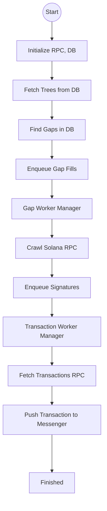

# Bubblegum

The bubblegum CLI assists in detecting and indexing missing updates for compression trees that are managed by the MPL bubblegum program.

## Commands

Command line arguments can also be set through environment variables.

### Backfill

The `backfill` command initiates the crawling and backfilling process. It requires the Solana RPC URL, the database URL, and the messenger Redis URL.

**warning**: The command expects full archive access to transactions. Before proceeding ensure your RPC is able to serve complete transaction history for Solana.  



```
Usage: das-ops bubblegum backfill [OPTIONS] --database-url <DATABASE_URL> --messenger-redis-url <MESSENGER_REDIS_URL> --solana-rpc-url <SOLANA_RPC_URL>

Options:
      --tree-crawler-count <TREE_CRAWLER_COUNT>
          Number of tree crawler workers [env: TREE_CRAWLER_COUNT=] [default: 20]
      --signature-channel-size <SIGNATURE_CHANNEL_SIZE>
          The size of the signature channel [env: SIGNATURE_CHANNEL_SIZE=] [default: 10000]
      --gap-channel-size <GAP_CHANNEL_SIZE>
          The size of the signature channel [env: GAP_CHANNEL_SIZE=] [default: 1000]
      --transaction-worker-count <TRANSACTION_WORKER_COUNT>
          The number of transaction workers [env: TRANSACTION_WORKER_COUNT=] [default: 100]
      --gap-worker-count <GAP_WORKER_COUNT>
          The number of gap workers [env: GAP_WORKER_COUNT=] [default: 25]
      --only-trees <ONLY_TREES>
          The list of trees to crawl. If not specified, all trees will be crawled [env: ONLY_TREES=]
      --database-url <DATABASE_URL>
          The database URL [env: DATABASE_URL=]
      --database-max-connections <DATABASE_MAX_CONNECTIONS>
          The maximum number of connections to the database [env: DATABASE_MAX_CONNECTIONS=] [default: 125]
      --database-min-connections <DATABASE_MIN_CONNECTIONS>
          The minimum number of connections to the database [env: DATABASE_MIN_CONNECTIONS=] [default: 5]
      --messenger-redis-url <MESSENGER_REDIS_URL>
          [env: MESSENGER_REDIS_URL=]
      --messenger-redis-batch-size <MESSENGER_REDIS_BATCH_SIZE>
          [env: MESSENGER_REDIS_BATCH_SIZE=] [default: 100]
      --messenger-queue-connections <MESSENGER_QUEUE_CONNECTIONS>
          [env: MESSENGER_QUEUE_CONNECTIONS=] [default: 25]
      --messenger-queue-stream <MESSENGER_QUEUE_STREAM>
          [env: MESSENGER_QUEUE_STREAM=] [default: TXNFILL]
      --metrics-host <METRICS_HOST>
          [env: METRICS_HOST=] [default: 127.0.0.1]
      --metrics-port <METRICS_PORT>
          [env: METRICS_PORT=] [default: 8125]
      --metrics-prefix <METRICS_PREFIX>
          [env: METRICS_PREFIX=] [default: das.backfiller]
      --solana-rpc-url <SOLANA_RPC_URL>
          [env: SOLANA_RPC_URL=]
  -h, --help
          Print help
```

### Metrics

The bubblegum command provides several metrics for monitoring performance and status:

Metric | Description
--- | ---
transaction.failed | Count of failed transaction
transaction.succeeded | Count of successfully queued transaction
transaction.queued | Time for a transaction to be queued
gap.failed | Count of failed gap crawling
gap.succeeded | Count of successfully crawled gaps
gap.queued | Time for a gap to be queued
tree.succeeded | Count of completed tree crawl
tree.crawled | Time to crawl a tree
job.completed | Time to complete the job